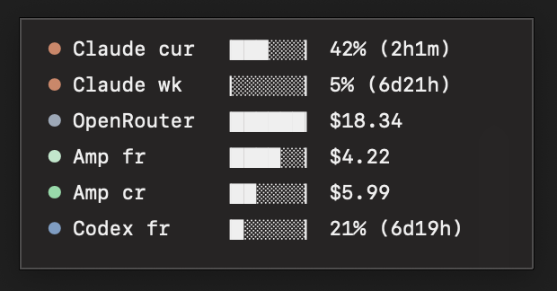

# Tokemon

macOS menu bar + floating overlay for monitoring token usage across LLM services.

> **Disclaimer:** Tokemon is an unofficial personal tool and is not affiliated with, endorsed by, or supported by Anthropic, OpenRouter, Sourcegraph (Amp), or OpenAI. It accesses usage data from each service using credentials you provide (session cookies, API keys, bearer tokens). Those credentials are stored locally in `~/.config/tokemon/config.json` and are sent only to the respective service's own API endpoint. No data is collected, transmitted, or shared by this tool beyond those direct API calls. Use at your own risk. Session cookies and tokens are sensitive — treat the config file like a password and ensure it is not committed to version control or shared.



Tracks usage for **Claude**, **OpenRouter**, **Amp**, and **Codex** in a single always-on-top window.

## Install

```bash
curl -L https://github.com/rvantonder/tokemon/releases/download/0.0.1/Tokemon.0.0.1.zip -o Tokemon.zip && unzip Tokemon.zip && open Tokemon.app
```

Or download the latest zip from [Releases](https://github.com/rvantonder/tokemon/releases) and unzip it.

### Build from source

```bash
pip install requests rumps pyobjc browser-cookie3 pyinstaller
make build
open dist/Tokemon.app
```

## Configuration

Tokemon reads `~/.config/tokemon/config.json` (created from `config.example.json` on first run). You can also open it from the menu bar → **Edit config…**.

```json
{
  "claude": {
    "org_id": "<org-id>",
    "session_cookie": "<cookie>"
  },
  "openrouter": {
    "api_key": "sk-or-v1-..."
  },
  "amp": {
    "session_cookie": "<cookie>"
  },
  "codex": {
    "bearer_token": "<token>"
  }
}
```

This gives you all six rows shown in the overlay: **Claude cur** (5h window), **Claude wk** (7d window), **OpenRouter**, **Amp fr** (free tier), **Amp cr** (credits), and **Codex fr**.

### Setup

Paste the following prompt into your favorite AI coding agent and follow it to populate `~/.config/tokemon/config.json`:

````text
Help me set up Tokemon by extracting credentials for the services I use.
Write them to ~/.config/tokemon/config.json using this template:

{
  "claude": {
    "org_id": "<org-id>",
    "session_cookie": "<session-cookie>"
  },
  "openrouter": {
    "api_key": "sk-or-v1-..."
  },
  "amp": {
    "session_cookie": "<session-cookie>"
  },
  "codex": {
    "bearer_token": "<bearer-token>"
  }
}

For each service:

**Claude** — I need org_id and session_cookie from claude.ai.
Use Playwright to:
1. Open https://claude.ai/settings/usage (I should already be logged in)
2. Intercept the network request to /api/organizations/<org-id>/usage
3. Extract the <org-id> from the URL
4. Extract the Cookie header value as the session_cookie

**OpenRouter** — I need an API key.
Use Playwright to:
1. Open https://openrouter.ai/settings/keys (I should already be logged in)
2. Copy an existing API key, or create one and copy it

**Amp** — I need a session cookie from ampcode.com.
Use Playwright to:
1. Open https://ampcode.com/settings (I should already be logged in)
2. Extract the cookie header from any network request to ampcode.com

**Codex** — I need a bearer token from chatgpt.com.
Use Playwright to:
1. Open https://chatgpt.com (I should already be logged in)
2. Intercept any request to chatgpt.com/backend-api/*
3. Extract the Authorization header value (without the "Bearer " prefix)

Only configure the services I tell you I use. Skip the rest.
````

### Extra services

You can add custom services via the `extra_services` array in config. Each entry needs an endpoint, auth, and field mappings:

```json
{
  "extra_services": [
    {
      "id":       "my-service",
      "label":    "My LLM",
      "type":     "generic",
      "endpoint": "https://api.example.com/usage",
      "auth": {
        "type":  "bearer",
        "token": "sk-..."
      },
      "fields": {
        "used":  "usage",
        "limit": "limit",
        "reset": "reset_at",
        "unit":  "$"
      }
    }
  ]
}
```

## How it works

Tokemon runs a background thread that polls each configured service's usage API endpoint every 60 seconds. Each service authenticates with the credential you provide (session cookie, API key, or bearer token) and the response is parsed for `used`, `limit`, and `reset` fields. The overlay window is updated in place — no server, no daemon, no background process beyond the app itself. The SwiftBar/xbar plugin variant (`tokemon.1m.py`) relies on xbar's built-in refresh mechanism instead.

## License

[Apache 2.0](LICENSE)
